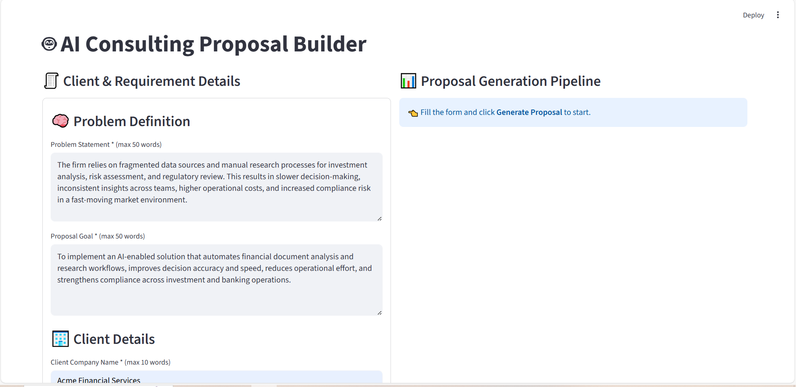
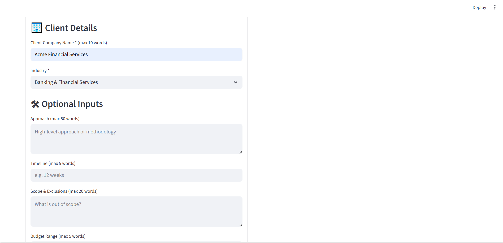
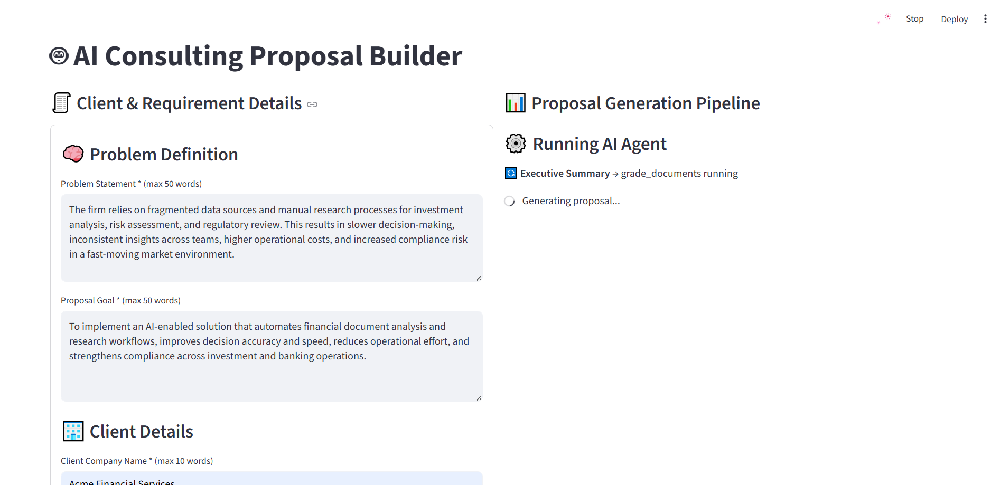
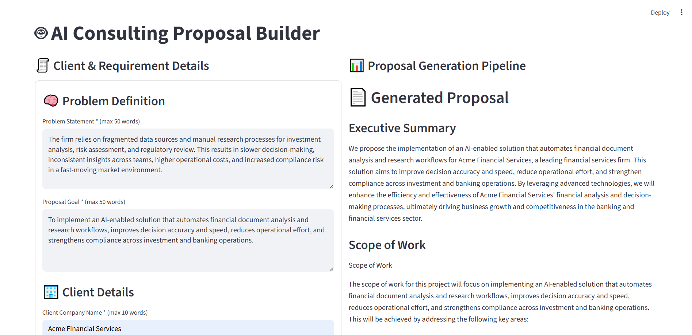
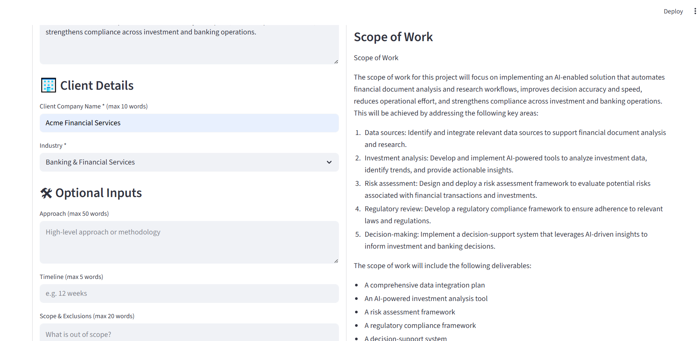
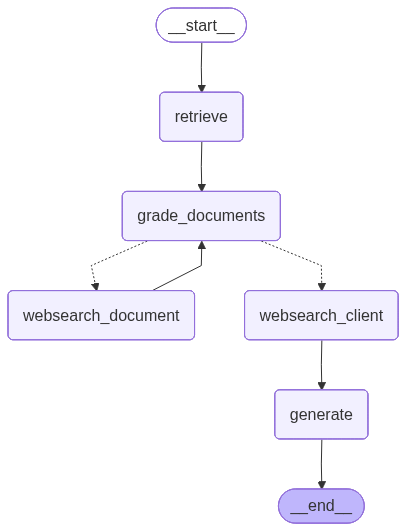

👀 **Check out the awesome app screenshots below!** 

# AI Consulting & Service Proposal Generator

An intelligent, agent-driven system for generating **high-quality consulting and service proposals** that align with real-world industry standards.

Unlike generic AI writing tools, this platform **automatically researches similar proposals, client context, and industry-specific practices** before generating content. The result is professional, human-like proposals that follow the **correct tone, structure, and expectations of the target industry**—without requiring manual research from the user.

---

## 🚀 Overview

The **AI Consulting & Service Proposal Generator** is designed to eliminate manual research and repetitive proposal drafting.

Before writing a single word, the system deploys multiple AI agents to:
- Search and analyze **existing consulting/service proposals** from the web
- Understand **industry norms, terminology, and writing style**
- Research the **client’s business, market, and challenges**
- Gather all required contextual information automatically

This ensures every proposal is **context-aware, industry-aligned, and client-specific**, while significantly reducing preparation time.

---

## 🎯 Key Features

- **Agent-Based Architecture**  
  Uses coordinated AI agents to perform research, analysis, and proposal generation.

- **Automatic Online Research**  
  Collects relevant consulting proposals, industry references, and client information directly from the web—no manual input required.

- **Industry-Specific Tone & Structure**  
  Adapts language, formatting, and proposal flow based on the client’s industry and problem domain.

- **Non–AI-Sounding Output**  
  Learns from real consulting documents to produce proposals that follow professional standards and human writing patterns.

- **Client-Aware Proposal Generation**  
  Automatically researches the client’s background, market, and challenges before generating content.

- **Reusable & Scalable**  
  Easily extendable to new industries, proposal types, and consulting domains.

---

## 🧠 How It Works

1. **Input**: Minimal user input (industry, problem statement, or client reference)
2. **Research Phase**:
   - Agents search for similar proposals and industry materials
   - Client and market data is gathered automatically
3. **Analysis Phase**:
   - Extracts structure, tone, and best practices
4. **Generation Phase**:
   - Produces a professional, tailored consulting/service proposal

---

## 🛠 Technology Stack

- **Language**: Python  
- **Dependency Management**: Poetry  
- **LLM Frameworks**: LangChain, LangGraph  
- **Vector Database**: ChromaDB  
- **Environment Configuration**: Python-dotenv  
- **Web Access & Search**: Tavily
- **UI**: Streamlit
- **Observability**: LangSmith

---

## 📌 Use Cases

- Consulting firms preparing client proposals
- Freelancers creating service proposals
- Pre-sales and business development teams
- AI-driven proposal automation platforms

---

## 📈 Benefits

- Saves hours of manual research and writing
- Produces industry-aligned, professional proposals
- Reduces dependency on generic AI outputs
- Improves proposal quality and acceptance rate

---

## 🔮 Future Enhancements

- Support for RFP/RFQ-specific proposal formats
- Proposal scoring and improvement suggestions
- Multi-language proposal generation
- Versioned proposal comparison

---

## 🖼 Screenshots

### Landing Page

  

  

### Running Agent

  

### Sample Generated Proposal

  

  

### Agent Graph Flow

  

👀 **For more Architectural C4 Diagrams check out 'architectural_diagrams' folder** 